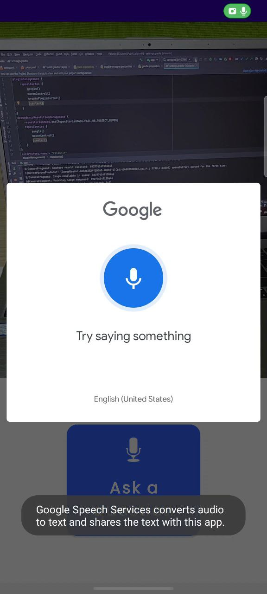
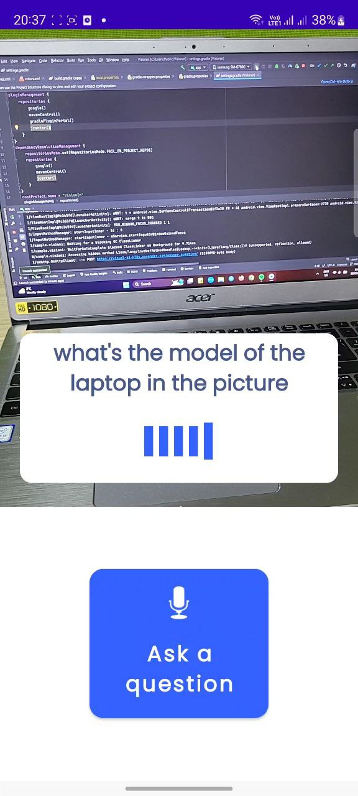
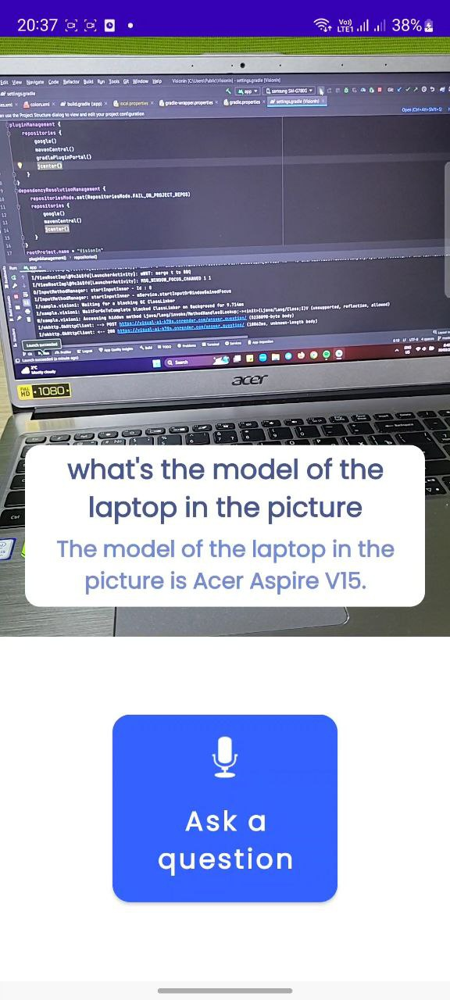

# Botagoz App
Android application for AI assistant designed specifically to empower individuals with visual impairments, which provides
users with a seamless and supportive experience in navigating their surroundings. 

## Algorithm

An Android phone sends the photo and the question to the FastAPI backend. It appends the question to the chat log. Then, a classifier based on ChatGPT analyzes whether it needs visual context. If so, it uses BLIP via the Replicate.com API and processes it. If not, it answers the question as it is. To see the implementation, please refer to the [backend repository](https://github.com/armanbolatov/botagoz_app_backend).

## Features
- image capturing
- image processing
- speech recognition

## Stack

**Language:** Kotlin

**Framework:** Native Android UI

**Architecture:** MVVM

## Libraries
- [Native Camera API](https://github.com/android/camera-samples)
- [Speech Recognizer](https://developer.android.com/reference/kotlin/android/speech/SpeechRecognizer)
- [Text-to-Speech](https://developer.android.com/reference/kotlin/android/speech/tts/TextToSpeech)

## Screenshots
Speech Recognition | Responding | Answer is displayed and voiced
--- | --- | --- 
 |  |  
